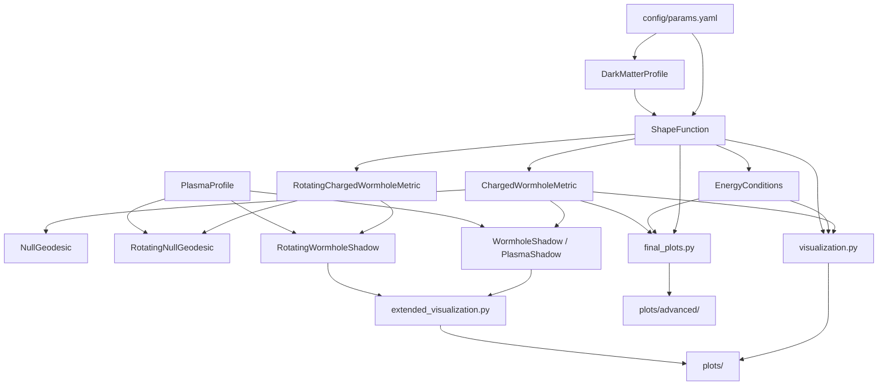

# Charged Galactic Wormhole: Metric, Energy Conditions, and Shadow Analysis

[](https://arxiv.org/abs/2503.16111)
[](https://arxiv.org/abs/2108.09930)
[](https://doi.org/10.1016/j.newast.2024.102183)
[](https://www.python.org/)
[](https://numpy.org/)
[](https://scipy.org/)
[](https://www.sympy.org/)
[](https://matplotlib.org/)
[](./tests/test_metric.py)

This repository implements a numerical and symbolic analysis of a **charged, dark-matter-embedded
traversable wormhole**, following the model of Rahaman et al. (2025), arXiv:2503.16111. It provides
a Python package (`src/`) that constructs the metric, evaluates energy conditions, integrates null
geodesics, and computes photon-sphere/shadow properties for both static and rotating configurations,
optionally in the presence of a plasma medium. Analysis scripts and a derivation notebook reproduce
the figures found in `plots/`.

The codebase is organized as a small research package rather than a general-purpose relativity
library: each module implements one piece of the physical model described in the source paper, and
the top-level scripts assemble these pieces into complete analysis pipelines.

---

## 1. Scientific Background

### 1.1 Galactic Dark Matter Density Profile

The wormhole is embedded in a galactic dark matter halo whose energy density is modeled (Eq. 9 of
the reference paper, as implemented in `src/dark_matter.py`) as an exponentially decaying profile

```
ρ_w(r) = ρ_s · exp(−r / r_s)
```

where `ρ_s` is a central density scale and `r_s` is the halo scale radius. This profile is the
physical motivation cited in the accompanying reference `Sofue2013` (Milky Way rotation curve),
which anchors the choice of an exponential dark-matter density as an empirically reasonable galactic
halo model.

### 1.2 Shape Function and the Charged Wormhole Metric

The wormhole geometry is a Morris–Thorne-type traversable wormhole (`MorrisThorne1988`) generalized
to include an electric charge `Q`. The line element implemented in `src/metric.py` (`ChargedWormholeMetric`)
is (Eq. 3):

```
ds² = −(1 + Q²/r²) dt² + (1 − b(r)/r + Q²/r²)⁻¹ dr² + r² (dθ² + sin²θ dφ²)
```

so that

- `g_tt(r) = −(1 + Q²/r²)`
- `g_rr(r) = [1 − b(r)/r + Q²/r²]⁻¹`
- `g_θθ(r) = r²`
- `g_φφ(r,θ) = r² sin²θ`

The diagonal inverse metric components (`inverse_metric`) are simply the reciprocals of these terms.

The shape function `b(r)` sourced by the dark-matter halo density is given in closed form
(`src/shape_function.py`, Eq. 11):

```
b(r) = −8 r_s (r² + 2 r r_s + 2 r_s²) e^(−r/r_s) π ρ_s + C₁
```

with `C₁` an integration constant (`config/params.yaml: wormhole.C1`). The charge modifies this
into an **effective shape function** (Eq. 12):

```
b_eff(r) = b(r) − Q²/r
```

which enters `g_rr` above. `ShapeFunction` supports both a NumPy-evaluated form (`b`, used for
plotting and root-finding) and a SymPy symbolic form (`b_symbolic`, `b_eff_symbolic`), the latter
used by the derivation notebook. Analytic derivatives `b_prime(r)` and `b_eff_prime(r)` are also
implemented in closed form (numeric-only; they raise if passed a symbolic input).

### 1.3 Throat and Flare-Out Conditions

`ShapeFunction.find_throat()` locates the wormhole throat radius `r₀` as the numerical root
(`scipy.optimize.root_scalar`, bracketed search in `[r_min, r_max]`, default `[0.1, 10.0]`) of the
standard throat condition

```
b_eff(r₀) = r₀
```

`ShapeFunction.check_flaring_out(r)` evaluates the Morris–Thorne flare-out condition

```
b_eff′(r) < 1
```

which must hold at the throat for the geometry to represent a traversable wormhole rather than a
horizon.

### 1.4 Energy Conditions

`src/energy_conditions.py` (`EnergyConditions`) evaluates the stress-energy components implied by
the Einstein equations for this metric (Eqs. 4–8), given a `ShapeFunction` instance:

- Total energy density (Eq. 4): `ρ(r) = [b′(r)/r² + Q²/r⁴] / (8π)`
- Dark-matter energy density `ρ⁽⁰⁾(r)`: forwarded from `ShapeFunction.dm.density(r)` (Eq. 9/10)
- Electromagnetic energy density (Eq. 8): `ρ⁽¹⁾(r) = Q² / (8π r⁴)`
- A radial-pressure–related quantity `τ(r)` (Eq. 5), from which the radial pressure is
  `P_r(r) = −τ(r)`
- Tangential pressure `P_t(r) = P(r)` (Eq. 6), a longer expression combining the metric's
  `g_rr⁻¹` factor with charge- and shape-function–dependent terms

`check_NEC(r)` reports whether the null energy condition holds radially (`ρ + P_r ≥ 0`) and
tangentially (`ρ + P_t ≥ 0`), and `get_all(r)` bundles `ρ`, `P_r`, `P_t`, and the two NEC
combinations into a dictionary for plotting. The generated figures (Section 6) further construct
the strong energy condition combination `ρ + P_r + 2P_t` directly from these quantities.

### 1.5 Rotating Extension

`src/metric_rotating.py` (`RotatingChargedWormholeMetric`) extends the static metric with a
Teo-type rotation (`Teo1998`), parametrized by a spin parameter `a`:

- `g_tt`, `g_rr`, `g_θθ` are unchanged from the static metric
- Frame-dragging angular velocity: `ω(r) = 2a / r³`
- Off-diagonal term: `g_tφ(r,θ) = −ω(r) · r² sin²θ`
- Rotated azimuthal term: `g_φφ(r,θ) = r² sin²θ · [1 + ω(r)² r² sin²θ]`

The inverse metric is computed from the 2×2 block determinant `det = g_tt g_φφ − g_tφ²` of the
`(t, φ)` sector, combined with the unchanged diagonal `g_rr`, `g_θθ` inverses.

### 1.6 Photon Propagation: Geodesics and Effective Potentials

`src/geodesics.py` (`NullGeodesic`) and `src/geodesics_rotating.py` (`RotatingNullGeodesic`)
implement a Hamiltonian formulation of null geodesic motion,
`H = ½ g^{μν} p_μ p_ν` (with an added refractive term `ω_p²(r,θ)` from the plasma profile in the
rotating case). The coordinate equations of motion `dx^μ/ds = ∂H/∂p_μ = g^{μν} p_ν` are integrated
with `scipy.integrate.solve_ivp` (RK45, `rtol=1e-8`, `atol=1e-10`). As implemented, the momentum
components `(p_r, p_θ, p_φ, p_t)` are all assigned zero time-derivative in `geodesic_equations`;
that is, every momentum component—including `p_r` and `p_θ`, which are not associated with a
Killing vector of this metric—is held fixed along the integrated path, so the solver advances only
the coordinates for a given, unevolving set of conserved momenta.

`RotatingNullGeodesic.find_photon_sphere()` locates the equatorial photon-sphere radius by
maximizing an effective potential

```
V_eff(r) = −det(g_tt, g_φφ, g_tφ) / [g_φφ · (1 − ω_p²(r))]
```

via `scipy.optimize.minimize_scalar` on `−V_eff(r)`.

### 1.7 Plasma Environment

`src/plasma.py` (`PlasmaProfile`) supplies a plasma frequency-squared function `ω_p²(r,θ)` used to
modify photon propagation, selectable by `profile_type`:

| `profile_type`  | `ω_p²(r, θ)`                        |
|-----------------|--------------------------------------|
| `homogeneous`   | constant `density_param`             |
| `longitudinal`  | `density_param · (1 + 2 sin²θ)`      |
| `radial`        | `density_param / r^(3/2)`            |
| `spherical`     | `density_param / r²`                 |
| other           | `0.0`                                |

Only the `homogeneous` case is treated specially by the shadow classes below (through an explicit
`profile_type == 'homogeneous'` check); the other profiles feed only into the geodesic Hamiltonian.

### 1.8 Photon Sphere and Shadow Construction

Three shadow classes exist, sharing a common pattern:

- **`WormholeShadow`** (`src/shadow.py`) and **`PlasmaShadow`** (`src/shadow_plasma.py`, functionally
  near-identical to `WormholeShadow` but structured to take a plasma profile explicitly) — static
  wormhole shadows.
- **`RotatingWormholeShadow`** (`src/shadow_rotating.py`) — shadows for the Teo-type rotating metric.

In all three, the photon-sphere radius `r_ph` is found by maximizing an effective potential
`V_eff(r) = −g_tt(r)(1 − ω_p²) / g_rr(r)` (static case) or the rotating analogue described in §1.6,
via `scipy.optimize.minimize_scalar`.

`generate_shadow` / `generate_shadow_image` render the shadow as a binary pixel image on an
`(α, β)` grid: a pixel is assigned to the shadow (`0.0`) if its distance from the origin is less
than a critical radius `r_crit`, taken to be `r_ph` (vacuum) or `r_ph / sqrt(1 − ρ)` for a
homogeneous plasma of density `ρ < 1` — i.e., the shadow is rendered as a filled disk of radius
`r_crit`, not by ray-tracing individual photon trajectories.

`shadow_boundary` (static classes) computes celestial coordinates via `α = −η / sin θ_o` and
`β² = ξ² − η²` for a parameter `ξ` swept over `[−5, 5]`, with `η` assigned equal to `ξ` at each
sample point (optionally rescaled by a homogeneous-plasma factor `1/√(1−ρ)`). Because `η` is set
equal to `ξ`, the quantity `ξ² − η²` evaluates to zero at every sample, so the `β² > 0` selection
never accepts a point for the vacuum case; the rotating class's own `shadow_boundary`
(`RotatingWormholeShadow`) instead uses a Bardeen-style parametrization,
`α = −η/sin θ_o`, `β² = ξ − (η−a)² + a² cos²θ_o − η² cot²θ_o`, with `η = −a + √ξ` for `ξ > 0`
(else `η = −a`), and this formula is what actually populates the boundary curves and the
parameter-space scan described in §3 below.

---

## 2. Repository Architecture



The three entry-point scripts (`run_analysis.py`, `run_extended_analysis.py`, `final_plots.py`) each
drive a subset of this pipeline, described in Section 4.

---

## 3. Module-by-Module Documentation (`src/`)

### `dark_matter.py` — `DarkMatterProfile`
Implements the exponential halo density `ρ_w(r)` (Eq. 9). Accepts `rho_s`, `r_s` directly, or a
`config_path` from which they are read via `yaml.safe_load`. Consumed by `ShapeFunction` (which
instantiates its own internal `DarkMatterProfile` from the same `rho_s`, `r_s`) and directly by
`EnergyConditions.rho_0` and by `final_plots.py`'s shape-function figure.

### `shape_function.py` — `ShapeFunction`
Implements `b(r)` and `b_eff(r)` (Eqs. 11–12) both numerically (NumPy) and symbolically (SymPy),
their analytic derivatives, the throat-finding root solve, and the flare-out check. Depends on
`DarkMatterProfile` (instantiated internally as `self.dm`). Consumed by `ChargedWormholeMetric`,
`RotatingChargedWormholeMetric`, and `EnergyConditions`.

### `metric.py` — `ChargedWormholeMetric`
Implements the static charged-wormhole line element (Eq. 3) and its diagonal inverse. Takes a
`ShapeFunction` instance at construction and reads `Q` from it. Consumed by `NullGeodesic`,
`WormholeShadow`, `PlasmaShadow`, and the visualization/analysis scripts.

### `metric_rotating.py` — `RotatingChargedWormholeMetric`
Extends the static metric with Teo-type frame dragging parametrized by spin `a` (§1.5). Consumed
by `RotatingNullGeodesic` and `RotatingWormholeShadow`.

### `energy_conditions.py` — `EnergyConditions`
Implements the density/pressure expressions (Eqs. 4–8) and the null energy condition check (§1.4).
Depends on `ShapeFunction` (for `b`, `b_prime`, and the embedded dark-matter profile). Consumed by
`visualization.plot_energy_conditions`, `plot_generator.plot_energy_conditions_comparison`, and
`final_plots.plot_energy_conditions_advanced` / `plot_comprehensive_summary`.

### `geodesics.py` — `NullGeodesic`
Static-metric Hamiltonian null-geodesic integrator (§1.6). Depends on `ChargedWormholeMetric`.
Instantiated internally by `WormholeShadow` but its `integrate`/`hamiltonian` methods are not
otherwise called elsewhere in the analysis scripts examined.

### `geodesics_rotating.py` — `RotatingNullGeodesic`
Rotating-metric analogue including a plasma refractive term in the Hamiltonian, plus
`find_photon_sphere` (§1.6). Depends on `RotatingChargedWormholeMetric` and, optionally,
`PlasmaProfile`.

### `plasma.py` — `PlasmaProfile`
Plasma frequency-squared profiles selectable by name (§1.7). Consumed by the geodesic and shadow
classes wherever a plasma medium is modeled.

### `shadow.py` — `WormholeShadow`
Static-wormhole photon-sphere finder, shadow-boundary curve (`shadow_boundary`, structurally
degenerate as noted in §1.8), and pixel-disk shadow image (`generate_shadow`). Depends on
`ChargedWormholeMetric`, optionally `PlasmaProfile`; internally constructs a `NullGeodesic` (unused
by its own methods). Driven by `run_extended_analysis.py`.

### `shadow_rotating.py` — `RotatingWormholeShadow`
Rotating-wormhole analogue: effective potential and photon sphere including the frame-dragging
cross-term, a Bardeen-style `celestial_coordinates`/`shadow_boundary` pair that is the one
implementation whose boundary curve is actually populated with nonzero points, and a pixel-disk
`generate_shadow_image`. Depends on `RotatingChargedWormholeMetric`, optionally `PlasmaProfile`.
Driven by `run_extended_analysis.py`.

### `shadow_plasma.py` — `PlasmaShadow`
A static-wormhole shadow class parallel to `WormholeShadow`, requiring a `PlasmaProfile` at
construction; its `shadow_boundary` has the same `ξ = η` structure noted in §1.8. Not imported by
any of the top-level scripts examined; it is exported from the package via `src/__init__.py`.

### `visualization.py`
Three baseline plotting functions used by `run_analysis.py`:
- `plot_shape_functions`: `b(r)` and `b_eff(r)` vs. `r` (with the reference line `b_eff = r`).
- `plot_energy_conditions`: 2×2 panel of `ρ(r)`, `ρ+P_r`, `ρ+P_t`, and `ρ+P_r+2P_t`, each with a
  zero reference line.
- `plot_metric_components`: `g_tt(r)` and `g_rr(r)`.

### `extended_visualization.py`
Plotting helpers driven by `run_extended_analysis.py`:
- `plot_plasma_effect_series` / `plot_rotation_effect_series`: grids of pixel-disk shadow images
  labeled by plasma density `ρ` or spin `a`.
- `plot_kerr_vs_wormhole_comparison`: side-by-side comparison of a schematic Kerr shadow (see
  `run_extended_analysis.create_kerr_shadow`, §4) and a computed wormhole shadow image.
- `plot_shadow_boundary_comparison`: overlays multiple `(α, β)` boundary curves.
- `plot_eht_constraints`: fills caller-supplied polygonal "allowed regions" (labeled, e.g., `M87*`,
  `Sgr A*`) on an `(a, ρ)` parameter plane; the polygons themselves are illustrative inputs passed
  in by the caller, not derived from a shadow-radius computation within this function.

### `plot_generator.py`
A more elaborate, largely parallel set of plotting functions (4-panel shape-function and
energy-condition comparisons, a deflection-angle comparison against a Schwarzschild reference
`4M/b`, a shadow-boundary comparison, and 2D/3D `R(a, ρ)` parameter-space plots). These functions
take already-computed data (`impact_params`, `deflection_data`, `R_values`, etc.) as arguments; they
are not called from any of the three top-level scripts examined and are not currently wired into a
generation pipeline in this repository.

---

## 4. Executable Scripts

### `run_analysis.py`
Loads `config/params.yaml`, builds `DarkMatterProfile`, `ShapeFunction`, `ChargedWormholeMetric`,
and `EnergyConditions` from the configured parameters, and evaluates them on
`r ∈ [r_min, r_max]` (`n_points` samples). It then:
1. Calls `plot_shape_functions`, saving `plots/shape_functions/shape_analysis.png`, and prints the
   throat radius and `b_eff′(r₀)` if `find_throat()` succeeds.
2. Calls `plot_energy_conditions`, saving `plots/energy_conditions/energy_conditions.png`.
3. Calls `plot_metric_components`, saving `plots/metric_components.png`.

The script also creates a larger set of output directories
(`plots/shadows/{static,rotating,plasma}`, `plots/comparisons/{kerr_vs_wormhole,plasma_comparisons,
parameter_space,observational}`) in anticipation of the shadow/comparison figures produced by
`run_extended_analysis.py`, though it does not itself populate them.

### `run_extended_analysis.py`
Loads the same configuration and constructs a static metric (`ChargedWormholeMetric`), then:
1. **Static shadow** — `WormholeShadow(metric_static).generate_shadow(200)` →
   `plots/shadows/static/static_vacuum_shadow.png`.
2. **Plasma shadows** — homogeneous-plasma shadows for `ρ ∈ {0, 0.3, 0.5, 0.7}`, combined via
   `plot_plasma_effect_series` → `plots/comparisons/plasma_comparisons/plasma_effect_series.png`.
3. **Rotating shadows** — `RotatingChargedWormholeMetric(sf, a)` shadows for
   `a ∈ {0, 0.3, 0.6, 0.9}`, combined via `plot_rotation_effect_series` →
   `plots/comparisons/parameter_space/rotation_effect_series.png`.
4. **Kerr comparison** — a schematic Kerr-black-hole shadow is synthesized by
   `create_kerr_shadow(a=0.9)`, a simple circular disk of radius `r_shadow = 6(1 − 0.3a)` pixels
   (not a geodesic-based Kerr shadow computation), compared against the `a = 0.9` wormhole shadow
   image from step 3 via `plot_kerr_vs_wormhole_comparison` →
   `plots/comparisons/kerr_vs_wormhole/kerr_comparison.png`.
5. **Shadow boundaries** — static-vacuum, static-plasma (`ρ = 0.5`), and rotating (`a = 0.9`)
   boundary curves via each shadow class's `shadow_boundary()`, combined via
   `plot_shadow_boundary_comparison` →
   `plots/comparisons/shadow_boundaries/boundary_comparison.png`.
6. **Parameter space** — a `20 × 20` grid over spin `a ∈ [0, 0.9]` and plasma density
   `ρ ∈ [0, 0.7]`; at each grid point, `RotatingWormholeShadow(metric_rot, plasma).shadow_boundary()`
   is evaluated and its root-mean-square radius `√⟨α² + β²⟩` recorded as `Z[i,j]`, rendered as a 3D
   surface → `plots/comparisons/parameter_space/3d_parameter_space.png`.
7. **EHT constraints** — schematic, hand-specified polygonal "allowed regions" labeled `M87*` and
   `Sgr A*` on the `(a, ρ)` plane, via `plot_eht_constraints` →
   `plots/comparisons/observational/eht_constraints.png`. These polygons are illustrative inputs
   defined directly in the script and are not derived from an observational-constraint calculation
   within the repository.

### `final_plots.py`
A standalone "advanced publication plots" script. It loads `config/params.yaml` and constructs
`ShapeFunction` and `EnergyConditions` as in `run_analysis.py`, then produces seven figures in
`plots/advanced/`. Two categories of figures are generated:

- **Figures computed from the repository's physics classes:**
  - `plot_shape_function_advanced` — six panels: `b(r)`, `b_eff(r)`, the flare-out ratio
    `b_eff(r)/r`, `b_eff′(r)`, the dark-matter density `ρ_w(r)` (via `DarkMatterProfile`), and a
    text summary of the parameters and throat properties.
  - `plot_energy_conditions_advanced` — six panels: `ρ(r)`, NEC (radial), NEC (tangential),
    SEC (`ρ+P_r+2P_t`), a pressure comparison (`P_r`, `P_t`), and a text summary of which
    conditions are satisfied/violated.
  - `plot_comprehensive_summary` — six panels combining `b_eff(r)`, the three energy-condition
    combinations, the pressures, the metric components `g_tt`/`g_rr` (via `ChargedWormholeMetric`),
    the flare-out ratio, and a text summary table.

- **Figures using illustrative/schematic representative formulas, not computed from the
  repository's shadow or geodesic classes:**
  - `plot_shadow_radius_advanced` — shadow-radius-vs-spin and shadow-radius-vs-plasma-density
    curves for "Kerr", "vacuum", "plasma", and "rotating" cases, all defined by hand-picked
    polynomial formulas in `a` and `ρ` (e.g., `vacuum = 5.2(1 + 0.3a + 0.05a²)`), together with a
    table of representative M87\*/Sgr A\* observational values (`11 ± 1.5 M`, `9.5 ± 1.4 M`).
  - `plot_deflection_advanced` — deflection-angle curves of the schematic form
    `4/b · (1 + α/b)` compared against the Schwarzschild reference `4/b`, for representative
    values of a parameter `α`; these are illustrative curve shapes, independent of the model's
    actual `ρ_s`, `r_s`, `C1`, `Q` parameters.
  - `plot_eht_advanced` — a parameter-space polygon plot, a bar-chart comparison of representative
    shadow radii against M87\*/Sgr A\* observational bands, and a contour plot of a hand-specified
    formula `R(a, ρ) = 5.2/√(1−ρ+0.01) · (1 + 0.3a + 0.05a²)`.
  - `plot_shadow_boundary_comparison_advanced` — circular boundary curves using the same
    representative radius formulas as above, rather than the geodesic-derived `shadow_boundary()`
    methods in `shadow.py`/`shadow_rotating.py`.

  These schematic figures are useful for illustrating expected qualitative trends and for framing
  the model against real EHT results, but the numeric values they display are not outputs of the
  metric/geodesic/shadow computations implemented elsewhere in `src/`.

---

## 5. Notebook (`notebooks/01_metric_derivation.ipynb`)

The notebook loads `config/params.yaml` and instantiates `DarkMatterProfile`, `ShapeFunction`, and
`ChargedWormholeMetric` exactly as `run_analysis.py` does. It then re-derives the shape function
symbolically with SymPy (`r, theta = sp.symbols(...)`, `b_sym = -8 r_s(r²+2rr_s+2r_s²)e^{-r/r_s}πρ_s
+ C1`), and prints the corresponding symbolic `g_tt` and `g_rr` expressions (Eq. 3) with the
configured numeric parameters substituted in. The cached output cell shows, for example,
`g_tt = -1 - 0.01/r**2` and a `g_rr` expression built from the same `b_sym` formula; this reflects
the parameter values active in `config/params.yaml` at the time the notebook was last executed and
is included here as a worked symbolic check of the closed-form metric components rather than as a
numerical output artifact. A final code cell (`plt.subplots(1, 2, ...)` reproducing `g_tt(r)` and
`g_rr(r)` plots, matching `visualization.plot_metric_components`) is present with its rendered
output embedded in the notebook; `notebooks/plots/shadow_analysis_improved.png` and
`shadow_radius_corrected.png` are referenced image assets stored alongside the notebook but are not
generated by any cell shown in the notebook as provided.

---

## 6. Generated Figures (`plots/`)

Three parallel sets of figures exist, corresponding to the three generation scripts described in
Section 4. As noted there, the shape-function, energy-condition, and comprehensive-summary panels
in each set are grounded in the repository's `ShapeFunction`/`EnergyConditions`/`ChargedWormholeMetric`
computations, while the shadow-radius, deflection-angle, and EHT-constraint panels produced by
`final_plots.py` use illustrative representative formulas rather than the repository's own
geodesic/shadow classes (`shadow.py`, `shadow_rotating.py`).

### 6.1 `plots/advanced/` — `final_plots.py` output (7 figures)

| | |
|---|---|
|  **`01_shape_function_advanced.png`**<br>`b(r)`, `b_eff(r)`, the flare-out ratio, `b_eff′(r)`, the dark-matter density `ρ_w(r)`, and a parameter/throat summary table. *(Computed from `ShapeFunction`/`DarkMatterProfile`.)* |  **`02_energy_conditions_advanced.png`**<br>`ρ(r)`, NEC (radial), NEC (tangential), SEC, a pressure comparison, and a satisfied/violated summary. *(Computed from `EnergyConditions`.)* |
|  **`03_shadow_radius_advanced.png`**<br>Shadow radius vs. spin and vs. plasma density for "Kerr / vacuum / plasma / rotating" cases. *(Illustrative representative formulas — see Section 4.)* |  **`04_deflection_advanced.png`**<br>Deflection angle vs. impact parameter, linear and log–log, against the Schwarzschild reference `4/b`. *(Illustrative representative formulas.)* |
|  **`05_eht_advanced.png`**<br>Allowed `(a, ρ)` parameter space, an M87\*/Sgr A\* bar-chart comparison, and a shadow-radius contour map. *(Illustrative representative formulas.)* |  **`06_shadow_boundary_advanced.png`**<br>Circular boundary curves vs. spin and vs. plasma density. *(Illustrative representative formulas.)* |
|  **`07_comprehensive_summary_advanced.png`**<br>`b_eff(r)`, energy conditions, pressures, `g_tt`/`g_rr`, flare-out ratio, and a text summary in one figure. *(Computed from `ShapeFunction`/`EnergyConditions`/`ChargedWormholeMetric`.)* | |

### 6.2 `plots/final/` (5 figures)

| | |
|---|---|
|  **`01_shape_function.png`** |  **`02_energy_conditions.png`** |
|  **`03_shadow_comparison.png`** |  **`04_deflection_angle.png`** |
|  **`05_eht_constraints.png`** | |

### 6.3 `plots/enhanced/` (5 figures — alternate styling of the same topics)

| | |
|---|---|
|  **`01_shape_function_enhanced.png`** |  **`02_energy_conditions_enhanced.png`** |
|  **`03_shadow_radius_analysis.png`** |  **`04_comprehensive_comparison.png`** |
|  **`05_eht_constraints_enhanced.png`** | |

### 6.4 `notebooks/plots/` — assets referenced alongside the derivation notebook

| | |
|---|---|
|  **`shadow_analysis_improved.png`** |  **`shadow_radius_corrected.png`** |

As noted in Section 5, these two images are stored alongside `01_metric_derivation.ipynb` but are
not generated by any cell shown in the notebook as provided.

---

## 7. Testing (`tests/test_metric.py`)

`TestMetric` (pytest) constructs a `ShapeFunction`/`ChargedWormholeMetric` pair with
`ρ_s = 0.05, r_s = 1.0, C₁ = 0.0, Q = 0.1` and checks, at `r = 2.0`:

- `g_tt(r) == −(1 + Q²/r²)` (`test_g_tt`)
- `g_rr(r) == 1 / (1 − b(r)/r + Q²/r²)` (`test_g_rr`)
- `metric_tensor(r, θ=π/4)` contains all four expected keys, with `g_thth = r²` and
  `g_phiphi = r² sin²θ` (`test_metric_tensor`)

Run with:

```bash
pytest tests/
```

No tests currently cover `EnergyConditions`, the geodesic integrators, the plasma profiles, the
rotating metric, or the shadow classes.

---

## 8. Configuration (`config/params.yaml`)

```yaml
dark_matter:
  rho_s: 0.01   # central dark-matter density (working value)
  r_s: 1.0      # dark-matter halo scale radius

wormhole:
  Q: 0.0        # electric charge (default: uncharged limit)
  C1: 1.0       # integration constant in b(r)

analysis:
  r_min: 0.5
  r_max: 10.0
  n_points: 1000
  r_throat: 1.0
```

`rho_s`, `r_s`, `C1`, and `Q` are consumed by `ShapeFunction`/`DarkMatterProfile` (directly, or via
each class's optional `config_path` argument). `r_min`, `r_max`, and `n_points` are read by
`run_analysis.py` to build the radial sampling grid used for the shape-function, energy-condition,
and metric-component plots. `analysis.r_throat` is present in the configuration file but is not
read by any of the scripts or modules examined in this repository (throat location is instead
computed numerically via `ShapeFunction.find_throat()`).

---

## 9. Installation

```bash
pip install -r requirements.txt
```

`requirements.txt` specifies: `numpy`, `scipy`, `sympy`, `matplotlib`, `pandas`, `plotly`,
`seaborn`, `pyyaml`, `jupyter`, `tqdm`, `pytest`, `imageio`. Of these, the modules examined in this
repository import `numpy`, `scipy` (`optimize`, `integrate`), `sympy`, `matplotlib`, `yaml`, and
`tqdm` directly; `pytest` is used to run the test suite; `jupyter` is required to execute the
derivation notebook. `pandas`, `plotly`, `seaborn`, and `imageio` are declared as dependencies but
are not imported by any source file examined here (`matplotlib`'s `seaborn-v0_8-paper`/`seaborn-v0_8`
*styles* are used via `plt.style.use`, which does not require importing the `seaborn` package
itself).

---

## 10. References (`docs/references.bib`)

### 10.1 Core sources

**Gravitational Lensing Due to Charged Galactic Wormhole (2025)**
Modules: `metric.py`, `shape_function.py`, `energy_conditions.py`

- *Full citation:* M. K. Hossain, F. Rahaman, *Int. J. Geom. Methods Mod. Phys.* **22**, 2550151
  (2025), [arXiv:2503.16111](https://arxiv.org/abs/2503.16111) [gr-qc].
- *Key content:* Proposes a "charged galactic wormhole" metric built on an exponential dark-matter
  density profile of the Sofue (2013) type, and analyzes the resulting spacetime, embedding
  surface, and light deflection.
- *Connection to this repository:* This is the primary paper implemented here — the metric
  (Eq. 3, `metric.py`), the shape function (Eqs. 11–12, `shape_function.py`), and the energy
  conditions (Eqs. 4–8, `energy_conditions.py`) are direct translations of its equations, as
  documented in Section 1 above.

**Shadows of Lorentzian Traversable Wormholes (2021)**
Modules: `shadow.py`, `shadow_rotating.py`

- *Full citation:* F. Rahaman, Ksh. N. Singh, R. Shaikh, T. Manna, S. Aktar, *Class. Quantum Grav.*
  **38**, 215007 (2021), [arXiv:2108.09930](https://arxiv.org/abs/2108.09930) [gr-qc].
- *Key content:* Investigates the shadows cast by rotating traversable wormholes, studying how
  wormhole parameters affect photon orbits and the shadow's shape and size.
- *Connection to this repository:* Provides the underlying methodology for the photon-sphere and
  shadow-boundary computations in `shadow.py` and `shadow_rotating.py` (Section 1.8), which this
  repository applies to the charged galactic wormhole metric of Hossain & Rahaman (2025) instead of
  the vacuum rotating wormhole treated in the original paper.

**Dark Matter Supporting Traversable Wormholes in the Galactic Halo (2024)**
Modules: `dark_matter.py`, `config/params.yaml`

- *Full citation:* S. Sarkar, N. Sarkar, S. Aktar, M. Sarkar, F. Rahaman, A. K. Yadav, *New
  Astronomy* **109**, 102183 (2024).
- *Key content:* Studies static wormholes embedded in the Milky Way's galactic halo using the
  Einasto dark-matter density profile, analyzing the properties and viability of dark-matter
  supported wormholes.
- *Connection to this repository:* Grounds the concept of a dark-matter-supported wormhole in a
  realistic galactic context, motivating the exponential halo density `ρ_w(r) = ρ_s e^{-r/r_s}`
  used in `dark_matter.py` and parametrized in `config/params.yaml`. Note that this repository
  implements the exponential profile of Eq. 9 in Hossain & Rahaman (2025) rather than the Einasto
  profile used in Sarkar et al. (2024).

### 10.2 Supporting foundational references

- **Sofue, Y. (2013)**, *Rotation curve of the Milky Way*, *Publ. Astron. Soc. Japan* **65**, S5 —
  the observational Milky Way rotation-curve work that motivates the exponential galactic
  dark-matter density profile used in `dark_matter.py` (see also Sarkar et al. 2024 above).
- **Morris, M. S. & Thorne, K. S. (1988)**, *Wormholes in spacetime and their use for interstellar
  travel*, *Am. J. Phys.* **56**(5), 395–412 — the foundational traversable-wormhole framework
  underlying the throat condition (`b_eff(r₀) = r₀`) and flare-out condition (`b_eff′(r₀) < 1`)
  implemented in `shape_function.py`.
- **Teo, E. (1998)**, *Rotating traversable wormholes*, *Phys. Rev. D* **58**, 024014 — the basis
  for the Teo-type rotating metric extension implemented in `metric_rotating.py`.
