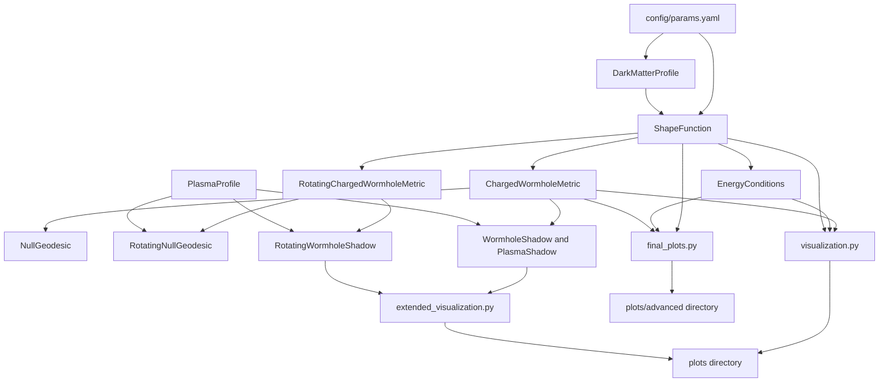

# Charged Galactic Wormhole: Metric, Energy Conditions, and Shadow Analysis

[](https://arxiv.org/abs/2503.16111)
[](https://arxiv.org/abs/2108.09930)
[](https://doi.org/10.1016/j.newast.2023.102183)
[](https://www.python.org/)
[](https://numpy.org/)
[](https://scipy.org/)
[](https://www.sympy.org/)
[](https://matplotlib.org/)
[](./tests/test_metric.py)

This repository implements a numerical and symbolic analysis of a charged, dark matter embedded,
traversable wormhole, following the model of Hossain and Rahaman (2025), arXiv:2503.16111. The
package (`src/`) constructs the metric, evaluates energy conditions, integrates null geodesics, and
computes photon sphere and shadow properties for static and rotating configurations, optionally in
the presence of a plasma medium. Three executable scripts and a derivation notebook reproduce the
figures collected in `plots/`.

The codebase is organized as a small research package rather than a general purpose relativity
library. Each module implements one piece of the physical model described in the source paper, and
the top level scripts assemble these pieces into complete analysis pipelines.

Note on the correction below: the New Astronomy reference badge above points to the article's
correct DOI, `10.1016/j.newast.2023.102183`. The original `docs/references.bib` and an earlier
version of this README carried a typo, `10.1016/j.newast.2024.102183`, which does not resolve; the
in text citation in Section 10 has been corrected accordingly.

## Table of Contents

1. [Scientific Background](#1-scientific-background)
2. [Repository Architecture](#2-repository-architecture)
3. [Module Documentation](#3-module-by-module-documentation-src)
4. [Executable Scripts](#4-executable-scripts)
5. [Derivation Notebook](#5-notebook-notebooks01_metric_derivationipynb)
6. [Generated Figures](#6-generated-figures-plots)
7. [Testing](#7-testing-testtest_metricpy)
8. [Configuration](#8-configuration-configparamsyaml)
9. [Installation](#9-installation)
10. [References](#10-references-docsreferencesbib)

## 1. Scientific Background

### 1.1 Galactic Dark Matter Density Profile

The wormhole is embedded in a galactic dark matter halo whose energy density is modeled, as
implemented in `src/dark_matter.py`, as an exponentially decaying profile (Eq. 9 of the reference
paper):

```math
\rho_w(r) = \rho_s \, e^{-r/r_s}
```

where $\rho_s$ is a central density scale and $r_s$ is the halo scale radius. This profile is
physically motivated by the reference `Sofue2013` (Milky Way rotation curve), which anchors the
choice of an exponential dark matter density as an empirically reasonable galactic halo model.

### 1.2 Shape Function and the Charged Wormhole Metric

The wormhole geometry is a Morris-Thorne type traversable wormhole (`MorrisThorne1988`) generalized
to include an electric charge $Q$. The line element implemented in `src/metric.py`
(`ChargedWormholeMetric`) is (Eq. 3):

```math
ds^2 = -\left(1 + \frac{Q^2}{r^2}\right) dt^2
+ \left(1 - \frac{b(r)}{r} + \frac{Q^2}{r^2}\right)^{-1} dr^2
+ r^2\left(d\theta^2 + \sin^2\theta \, d\phi^2\right)
```

so that

```math
g_{tt}(r) = -\left(1 + \frac{Q^2}{r^2}\right), \qquad
g_{rr}(r) = \left[1 - \frac{b(r)}{r} + \frac{Q^2}{r^2}\right]^{-1}, \qquad
g_{\theta\theta}(r) = r^2, \qquad
g_{\phi\phi}(r,\theta) = r^2 \sin^2\theta
```

The diagonal inverse metric components (`inverse_metric`) are simply the reciprocals of these terms.

The shape function $b(r)$ sourced by the dark matter halo density is given in closed form
(`src/shape_function.py`, Eq. 11):

```math
b(r) = -8 r_s \left(r^2 + 2 r r_s + 2 r_s^2\right) e^{-r/r_s} \, \pi \rho_s + C_1
```

with $C_1$ an integration constant (`config/params.yaml: wormhole.C1`). The charge modifies this
into an effective shape function (Eq. 12):

```math
b_{\text{eff}}(r) = b(r) - \frac{Q^2}{r}
```

which enters $g_{rr}$ above. `ShapeFunction` supports both a NumPy evaluated form (`b`, used for
plotting and root finding) and a SymPy symbolic form (`b_symbolic`, `b_eff_symbolic`), the latter
used by the derivation notebook. Analytic derivatives `b_prime(r)` and `b_eff_prime(r)` are also
implemented in closed form (numeric only; they raise if passed a symbolic input).

### 1.3 Throat and Flare Out Conditions

`ShapeFunction.find_throat()` locates the wormhole throat radius $r_0$ as the numerical root
(`scipy.optimize.root_scalar`, bracketed search in `[r_min, r_max]`, default `[0.1, 10.0]`) of the
standard throat condition

```math
b_{\text{eff}}(r_0) = r_0
```

`ShapeFunction.check_flaring_out(r)` evaluates the Morris-Thorne flare out condition

```math
b_{\text{eff}}'(r) < 1
```

which must hold at the throat for the geometry to represent a traversable wormhole rather than a
horizon.

### 1.4 Energy Conditions

`src/energy_conditions.py` (`EnergyConditions`) evaluates the stress energy components implied by
the Einstein equations for this metric (Eqs. 4 to 8), given a `ShapeFunction` instance.

Total energy density (Eq. 4):

```math
\rho(r) = \frac{1}{8\pi}\left(\frac{b'(r)}{r^2} + \frac{Q^2}{r^4}\right)
```

Dark matter energy density $\rho^{(0)}(r)$: forwarded from `ShapeFunction.dm.density(r)` (Eq. 9/10).

Electromagnetic energy density (Eq. 8):

```math
\rho^{(1)}(r) = \frac{Q^2}{8\pi r^4}
```

A radial-pressure related quantity $\tau(r)$ (Eq. 5), from which the radial pressure is
$P_r(r) = -\tau(r)$, and a tangential pressure $P_t(r) = P(r)$ (Eq. 6), a longer expression
combining the metric's $g_{rr}^{-1}$ factor with charge and shape-function dependent terms.

`check_NEC(r)` reports whether the null energy condition holds radially, $\rho + P_r \geq 0$, and
tangentially, $\rho + P_t \geq 0$, and `get_all(r)` bundles $\rho$, $P_r$, $P_t$, and the two NEC
combinations into a dictionary for plotting. The generated figures (Section 6) further construct
the strong energy condition combination $\rho + P_r + 2P_t$ directly from these quantities.

### 1.5 Rotating Extension

`src/metric_rotating.py` (`RotatingChargedWormholeMetric`) extends the static metric with a Teo type
rotation (`Teo1998`), parametrized by a spin parameter $a$:

$g_{tt}$, $g_{rr}$, $g_{\theta\theta}$ are unchanged from the static metric. The frame dragging
angular velocity is

```math
\omega(r) = \frac{2a}{r^3}
```

the off diagonal term is

```math
g_{t\phi}(r,\theta) = -\omega(r) \, r^2 \sin^2\theta
```

and the rotated azimuthal term is

```math
g_{\phi\phi}(r,\theta) = r^2 \sin^2\theta \left[1 + \omega(r)^2 r^2 \sin^2\theta\right]
```

The inverse metric is computed from the $2\times 2$ block determinant
$\det = g_{tt} g_{\phi\phi} - g_{t\phi}^2$ of the $(t,\phi)$ sector, combined with the unchanged
diagonal $g_{rr}$, $g_{\theta\theta}$ inverses.

### 1.6 Photon Propagation: Geodesics and Effective Potentials

`src/geodesics.py` (`NullGeodesic`) and `src/geodesics_rotating.py` (`RotatingNullGeodesic`)
implement a Hamiltonian formulation of null geodesic motion,

```math
H = \tfrac{1}{2} g^{\mu\nu} p_\mu p_\nu
```

with an added refractive term $\omega_p^2(r,\theta)$ from the plasma profile in the rotating case.
The coordinate equations of motion $dx^\mu/ds = \partial H/\partial p_\mu = g^{\mu\nu} p_\nu$ are
integrated with `scipy.integrate.solve_ivp` (RK45, `rtol=1e-8`, `atol=1e-10`). As implemented, the
momentum components $(p_r, p_\theta, p_\phi, p_t)$ are all assigned zero time derivative in
`geodesic_equations`; that is, every momentum component, including $p_r$ and $p_\theta$, which are
not associated with a Killing vector of this metric, is held fixed along the integrated path, so the
solver advances only the coordinates for a given, unevolving set of conserved momenta.

`RotatingNullGeodesic.find_photon_sphere()` locates the equatorial photon sphere radius by
maximizing an effective potential

```math
V_{\text{eff}}(r) = \frac{-\det(g_{tt}, g_{\phi\phi}, g_{t\phi})}{g_{\phi\phi}\left[1 - \omega_p^2(r)\right]}
```

via `scipy.optimize.minimize_scalar` on $-V_{\text{eff}}(r)$.


### 1.7 Plasma Environment

`src/plasma.py` (`PlasmaProfile`) supplies a plasma frequency squared function
$\omega_p^2(r,\theta)$ used to modify photon propagation, selectable by
`profile_type`:

| `profile_type` | $\omega_p^2(r,\theta)$ |
|:--|:--|
| `homogeneous` | constant `density_param` |
| `longitudinal` | `density_param` $\cdot (1 + 2\sin^2\theta)$ |
| `radial` | `density_param` $/\, r^{3/2}$ |
| `spherical` | `density_param` $/\, r^2$ |
| other | $0.0$ |

Only the `homogeneous` case is treated specially by the shadow classes below
(through an explicit `profile_type == 'homogeneous'` check); the other
profiles feed only into the geodesic Hamiltonian.

### 1.8 Photon Sphere and Shadow Construction

Three shadow classes exist, sharing a common pattern. `WormholeShadow` (`src/shadow.py`) and
`PlasmaShadow` (`src/shadow_plasma.py`, functionally near identical to `WormholeShadow` but
structured to take a plasma profile explicitly) compute static wormhole shadows.
`RotatingWormholeShadow` (`src/shadow_rotating.py`) computes shadows for the Teo type rotating
metric.

In all three, the photon sphere radius $r_{ph}$ is found by maximizing an effective potential

```math
V_{\text{eff}}(r) = \frac{-g_{tt}(r)\left(1 - \omega_p^2\right)}{g_{rr}(r)}
```

in the static case, or the rotating analogue described in Section 1.6, via
`scipy.optimize.minimize_scalar`.

`generate_shadow` and `generate_shadow_image` render the shadow as a binary pixel image on an
$(\alpha, \beta)$ grid: a pixel is assigned to the shadow ($0.0$) if its distance from the origin is
less than a critical radius $r_{crit}$, taken to be $r_{ph}$ in vacuum or
$r_{ph} / \sqrt{1-\rho}$ for a homogeneous plasma of density $\rho < 1$. The shadow is therefore
rendered as a filled disk of radius $r_{crit}$, not by ray tracing individual photon trajectories.

`shadow_boundary` (static classes) computes celestial coordinates via $\alpha = -\eta/\sin\theta_o$
and $\beta^2 = \xi^2 - \eta^2$ for a parameter $\xi$ swept over $[-5, 5]$, with $\eta$ assigned equal
to $\xi$ at each sample point (optionally rescaled by a homogeneous plasma factor
$1/\sqrt{1-\rho}$). Because $\eta$ is set equal to $\xi$, the quantity $\xi^2 - \eta^2$ evaluates to
zero at every sample, so the $\beta^2 > 0$ selection never accepts a point for the vacuum case. The
rotating class's own `shadow_boundary` (`RotatingWormholeShadow`) instead uses a Bardeen style
parametrization,

```math
\alpha = -\frac{\eta}{\sin\theta_o}, \qquad
\beta^2 = \xi - (\eta - a)^2 + a^2\cos^2\theta_o - \eta^2 \cot^2\theta_o
```

with $\eta = -a + \sqrt{\xi}$ for $\xi > 0$ (else $\eta = -a$), and this formula is what actually
populates the boundary curves and the parameter space scan described in Section 4.

## 2. Repository Architecture

The dependency graph below traces every module from its configuration source through to the figures
it ultimately feeds.



The three entry point scripts, `run_analysis.py`, `run_extended_analysis.py`, and `final_plots.py`,
each drive a subset of this pipeline, described in Section 4.

## 3. Module by Module Documentation (`src/`)

`dark_matter.py`, class `DarkMatterProfile`. Implements the exponential halo density $\rho_w(r)$
(Eq. 9). Accepts `rho_s`, `r_s` directly, or a `config_path` from which they are read via
`yaml.safe_load`. Consumed by `ShapeFunction` (which instantiates its own internal
`DarkMatterProfile` from the same `rho_s`, `r_s`) and directly by `EnergyConditions.rho_0` and by
`final_plots.py`'s shape function figure.

`shape_function.py`, class `ShapeFunction`. Implements $b(r)$ and $b_{\text{eff}}(r)$ (Eqs. 11 and
12) both numerically (NumPy) and symbolically (SymPy), their analytic derivatives, the throat
finding root solve, and the flare out check. Depends on `DarkMatterProfile` (instantiated internally
as `self.dm`). Consumed by `ChargedWormholeMetric`, `RotatingChargedWormholeMetric`, and
`EnergyConditions`.

`metric.py`, class `ChargedWormholeMetric`. Implements the static charged wormhole line element
(Eq. 3) and its diagonal inverse. Takes a `ShapeFunction` instance at construction and reads $Q$
from it. Consumed by `NullGeodesic`, `WormholeShadow`, `PlasmaShadow`, and the
visualization/analysis scripts.

`metric_rotating.py`, class `RotatingChargedWormholeMetric`. Extends the static metric with Teo type
frame dragging parametrized by spin $a$ (Section 1.5). Consumed by `RotatingNullGeodesic` and
`RotatingWormholeShadow`.

`energy_conditions.py`, class `EnergyConditions`. Implements the density and pressure expressions
(Eqs. 4 to 8) and the null energy condition check (Section 1.4). Depends on `ShapeFunction` (for
$b$, $b'$, and the embedded dark matter profile). Consumed by `visualization.plot_energy_conditions`,
`plot_generator.plot_energy_conditions_comparison`, and
`final_plots.plot_energy_conditions_advanced` / `plot_comprehensive_summary`.

`geodesics.py`, class `NullGeodesic`. Static metric Hamiltonian null geodesic integrator
(Section 1.6). Depends on `ChargedWormholeMetric`. Instantiated internally by `WormholeShadow` but
its `integrate`/`hamiltonian` methods are not otherwise called elsewhere in the analysis scripts.

`geodesics_rotating.py`, class `RotatingNullGeodesic`. Rotating metric analogue including a plasma
refractive term in the Hamiltonian, plus `find_photon_sphere` (Section 1.6). Depends on
`RotatingChargedWormholeMetric` and, optionally, `PlasmaProfile`.

`plasma.py`, class `PlasmaProfile`. Plasma frequency squared profiles selectable by name
(Section 1.7). Consumed by the geodesic and shadow classes wherever a plasma medium is modeled.

`shadow.py`, class `WormholeShadow`. Static wormhole photon sphere finder, shadow boundary curve
(`shadow_boundary`, structurally degenerate as noted in Section 1.8), and pixel disk shadow image
(`generate_shadow`). Depends on `ChargedWormholeMetric`, optionally `PlasmaProfile`; internally
constructs a `NullGeodesic` that is unused by its own methods. Driven by `run_extended_analysis.py`.

`shadow_rotating.py`, class `RotatingWormholeShadow`. Rotating wormhole analogue: effective potential
and photon sphere including the frame dragging cross term, a Bardeen style
`celestial_coordinates`/`shadow_boundary` pair that is the one implementation whose boundary curve is
actually populated with nonzero points, and a pixel disk `generate_shadow_image`. Depends on
`RotatingChargedWormholeMetric`, optionally `PlasmaProfile`. Driven by `run_extended_analysis.py`.

`shadow_plasma.py`, class `PlasmaShadow`. A static wormhole shadow class parallel to
`WormholeShadow`, requiring a `PlasmaProfile` at construction; its `shadow_boundary` has the same
$\xi = \eta$ structure noted in Section 1.8. Not imported by any of the top level scripts; it is
exported from the package via `src/__init__.py`.

`visualization.py`. Three baseline plotting functions used by `run_analysis.py`:
`plot_shape_functions` plots $b(r)$ and $b_{\text{eff}}(r)$ versus $r$ against the reference line
$b_{\text{eff}} = r$; `plot_energy_conditions` renders a two by two panel of $\rho(r)$,
$\rho + P_r$, $\rho + P_t$, and $\rho + P_r + 2P_t$, each with a zero reference line; and
`plot_metric_components` plots $g_{tt}(r)$ and $g_{rr}(r)$.

`extended_visualization.py`. Plotting helpers driven by `run_extended_analysis.py`:
`plot_plasma_effect_series` and `plot_rotation_effect_series` render grids of pixel disk shadow
images labeled by plasma density $\rho$ or spin $a$; `plot_kerr_vs_wormhole_comparison` places a
schematic Kerr shadow (see `run_extended_analysis.create_kerr_shadow`, Section 4) side by side with
a computed wormhole shadow image; `plot_shadow_boundary_comparison` overlays multiple
$(\alpha,\beta)$ boundary curves; and `plot_eht_constraints` fills caller supplied polygonal allowed
regions, labeled for example M87* or Sgr A*, on an $(a,\rho)$ parameter plane, where the polygons
themselves are illustrative inputs passed in by the caller and not derived from a shadow radius
computation within the function.

`plot_generator.py`. A more elaborate, largely parallel set of plotting functions: four panel shape
function and energy condition comparisons, a deflection angle comparison against a Schwarzschild
reference $4M/b$, a shadow boundary comparison, and 2D/3D $R(a,\rho)$ parameter space plots. These
functions take already computed data (`impact_params`, `deflection_data`, `R_values`, and so on) as
arguments; they are not called from any of the three top level scripts and are not currently wired
into a generation pipeline in this repository.

## 4. Executable Scripts

### `run_analysis.py`

Loads `config/params.yaml`, builds `DarkMatterProfile`, `ShapeFunction`, `ChargedWormholeMetric`,
and `EnergyConditions` from the configured parameters, and evaluates them on
$r \in [r_{\min}, r_{\max}]$ with `n_points` samples. It then:

1. Calls `plot_shape_functions`, saving `plots/shape_functions/shape_analysis.png`, and prints the
   throat radius and $b_{\text{eff}}'(r_0)$ if `find_throat()` succeeds.
2. Calls `plot_energy_conditions`, saving `plots/energy_conditions/energy_conditions.png`.
3. Calls `plot_metric_components`, saving `plots/metric_components.png`.

The script also creates a larger set of output directories
(`plots/shadows/{static,rotating,plasma}`, `plots/comparisons/{kerr_vs_wormhole,
plasma_comparisons, parameter_space, observational}`) in anticipation of the shadow and comparison
figures produced by `run_extended_analysis.py`, though it does not itself populate them.

### `run_extended_analysis.py`

Loads the same configuration and constructs a static metric (`ChargedWormholeMetric`), then:

1. Static shadow: `WormholeShadow(metric_static).generate_shadow(200)` produces
   `plots/shadows/static/static_vacuum_shadow.png`.
2. Plasma shadows: homogeneous plasma shadows for $\rho \in \{0, 0.3, 0.5, 0.7\}$, combined via
   `plot_plasma_effect_series` into `plots/comparisons/plasma_comparisons/plasma_effect_series.png`.
3. Rotating shadows: `RotatingChargedWormholeMetric(sf, a)` shadows for
   $a \in \{0, 0.3, 0.6, 0.9\}$, combined via `plot_rotation_effect_series` into
   `plots/comparisons/parameter_space/rotation_effect_series.png`.
4. Kerr comparison: a schematic Kerr black hole shadow is synthesized by `create_kerr_shadow(a=0.9)`,
   a simple circular disk of radius $r_{\text{shadow}} = 6(1-0.3a)$ pixels, not a geodesic based Kerr
   shadow computation, compared against the $a=0.9$ wormhole shadow image from step 3 via
   `plot_kerr_vs_wormhole_comparison` into `plots/comparisons/kerr_vs_wormhole/kerr_comparison.png`.
5. Shadow boundaries: static vacuum, static plasma ($\rho=0.5$), and rotating ($a=0.9$) boundary
   curves via each shadow class's `shadow_boundary()`, combined via `plot_shadow_boundary_comparison`
   into `plots/comparisons/shadow_boundaries/boundary_comparison.png`.
6. Parameter space: a $20 \times 20$ grid over spin $a \in [0, 0.9]$ and plasma density
   $\rho \in [0, 0.7]$; at each grid point, `RotatingWormholeShadow(metric_rot,
   plasma).shadow_boundary()` is evaluated and its root mean square radius
   $\sqrt{\langle \alpha^2 + \beta^2 \rangle}$ is recorded as $Z[i,j]$, rendered as a 3D surface into
   `plots/comparisons/parameter_space/3d_parameter_space.png`.
7. EHT constraints: schematic, hand specified polygonal allowed regions labeled M87* and Sgr A* on
   the $(a,\rho)$ plane, via `plot_eht_constraints` into
   `plots/comparisons/observational/eht_constraints.png`. These polygons are illustrative inputs
   defined directly in the script and are not derived from an observational constraint calculation
   within the repository.

### `final_plots.py`

A standalone advanced publication plots script. It loads `config/params.yaml` and constructs
`ShapeFunction` and `EnergyConditions` as in `run_analysis.py`, then produces seven figures in
`plots/advanced/`, falling into two categories.

Figures computed from the repository's physics classes:

- `plot_shape_function_advanced`: six panels covering $b(r)$, $b_{\text{eff}}(r)$, the flare out
  ratio $b_{\text{eff}}(r)/r$, $b_{\text{eff}}'(r)$, the dark matter density $\rho_w(r)$ (via
  `DarkMatterProfile`), and a text summary of the parameters and throat properties.
- `plot_energy_conditions_advanced`: six panels covering $\rho(r)$, NEC radial, NEC tangential, SEC
  ($\rho + P_r + 2P_t$), a pressure comparison ($P_r$, $P_t$), and a text summary of which
  conditions are satisfied or violated.
- `plot_comprehensive_summary`: six panels combining $b_{\text{eff}}(r)$, the three energy condition
  combinations, the pressures, the metric components $g_{tt}$/$g_{rr}$ (via
  `ChargedWormholeMetric`), the flare out ratio, and a text summary table.

Figures using illustrative or schematic representative formulas, not computed from the repository's
shadow or geodesic classes:

- `plot_shadow_radius_advanced`: shadow radius versus spin and versus plasma density curves for
  Kerr, vacuum, plasma, and rotating cases, all defined by hand picked polynomial formulas in $a$
  and $\rho$ (for example $R_{\text{vacuum}} = 5.2(1 + 0.3a + 0.05a^2)$), together with a table of
  representative M87*/Sgr A* observational values ($11 \pm 1.5\,M$, $9.5 \pm 1.4\,M$).
- `plot_deflection_advanced`: deflection angle curves of the schematic form
  $\frac{4}{b}\left(1 + \frac{\alpha}{b}\right)$ compared against the Schwarzschild reference
  $\frac{4}{b}$, for representative values of a parameter $\alpha$; these are illustrative curve
  shapes, independent of the model's actual $\rho_s$, $r_s$, $C_1$, $Q$ parameters.
- `plot_eht_advanced`: a parameter space polygon plot, a bar chart comparison of representative
  shadow radii against M87*/Sgr A* observational bands, and a contour plot of a hand specified
  formula $R(a,\rho) = \frac{5.2}{\sqrt{1-\rho+0.01}}\left(1 + 0.3a + 0.05a^2\right)$.
- `plot_shadow_boundary_comparison_advanced`: circular boundary curves using the same representative
  radius formulas as above, rather than the geodesic derived `shadow_boundary()` methods in
  `shadow.py`/`shadow_rotating.py`.

These schematic figures illustrate expected qualitative trends and frame the model against real EHT
results, but the numeric values they display are not outputs of the metric, geodesic, or shadow
computations implemented elsewhere in `src/`.

## 5. Notebook (`notebooks/01_metric_derivation.ipynb`)

The notebook loads `config/params.yaml` and instantiates `DarkMatterProfile`, `ShapeFunction`, and
`ChargedWormholeMetric` exactly as `run_analysis.py` does. It then re-derives the shape function
symbolically with SymPy, `r, theta = sp.symbols(...)`,

```math
b_{\text{sym}}(r) = -8 r_s\left(r^2 + 2rr_s + 2r_s^2\right)e^{-r/r_s}\pi\rho_s + C_1
```

and prints the corresponding symbolic $g_{tt}$ and $g_{rr}$ expressions (Eq. 3) with the configured
numeric parameters substituted in. The cached output cell shows, for the parameters active in
`config/params.yaml` at the time the notebook was last executed,

```math
g_{tt} = -1 - \frac{0.01}{r^2}
```

and a $g_{rr}$ expression built from the same $b_{\text{sym}}$ formula; this is included as a
worked symbolic check of the closed form metric components rather than as a numerical output
artifact. A final code cell (`plt.subplots(1, 2, ...)`, reproducing the $g_{tt}(r)$ and $g_{rr}(r)$
plots that match `visualization.plot_metric_components`) is present with its rendered output
embedded in the notebook. `notebooks/plots/shadow_analysis_improved.png` and
`shadow_radius_corrected.png` are referenced image assets stored alongside the notebook but are not
generated by any cell shown in the notebook as provided; they are reproduced in Section 6.4 below.

## 6. Generated Figures (`plots/`)

Three parallel sets of figures exist, corresponding to the three generation scripts described in
Section 4. In each set, the shape function, energy condition, and comprehensive summary panels are
grounded in the repository's `ShapeFunction`, `EnergyConditions`, and `ChargedWormholeMetric`
computations, while the shadow radius, deflection angle, and EHT constraint panels produced by
`final_plots.py` use illustrative representative formulas rather than the repository's own
geodesic/shadow classes (`shadow.py`, `shadow_rotating.py`), as detailed in Section 4.

### 6.1 `plots/advanced/`: `final_plots.py` output, seven figures

| Figure | Description |
|---|---|
|  | `01_shape_function_advanced.png`: $b(r)$, $b_{\text{eff}}(r)$, the flare out ratio, $b_{\text{eff}}'(r)$, the dark matter density $\rho_w(r)$, and a parameter/throat summary table. Computed from `ShapeFunction`/`DarkMatterProfile`. |
|  | `02_energy_conditions_advanced.png`: $\rho(r)$, NEC radial, NEC tangential, SEC, a pressure comparison, and a satisfied/violated summary. Computed from `EnergyConditions`. |
|  | `03_shadow_radius_advanced.png`: shadow radius versus spin and versus plasma density for Kerr, vacuum, plasma, and rotating cases. Illustrative representative formulas, see Section 4. |
|  | `04_deflection_advanced.png`: deflection angle versus impact parameter, linear and log-log, against the Schwarzschild reference $4/b$. Illustrative representative formulas. |
|  | `05_eht_advanced.png`: allowed $(a,\rho)$ parameter space, an M87*/Sgr A* bar chart comparison, and a shadow radius contour map. Illustrative representative formulas. |
|  | `06_shadow_boundary_advanced.png`: circular boundary curves versus spin and versus plasma density. Illustrative representative formulas. |
|  | `07_comprehensive_summary_advanced.png`: $b_{\text{eff}}(r)$, energy conditions, pressures, $g_{tt}$/$g_{rr}$, flare out ratio, and a text summary, in one figure. Computed from `ShapeFunction`/`EnergyConditions`/`ChargedWormholeMetric`. |

### 6.2 `plots/final/`, five figures

| Figure | Description |
|---|---|
|  | `01_shape_function.png` |
|  | `02_energy_conditions.png` |
|  | `03_shadow_comparison.png` |
|  | `04_deflection_angle.png` |
|  | `05_eht_constraints.png` |

### 6.3 `plots/enhanced/`, five figures, alternate styling of the same topics

| Figure | Description |
|---|---|
|  | `01_shape_function_enhanced.png` |
|  | `02_energy_conditions_enhanced.png` |
|  | `03_shadow_radius_analysis.png` |
|  | `04_comprehensive_comparison.png` |
|  | `05_eht_constraints_enhanced.png` |

### 6.4 `notebooks/plots/`: assets referenced alongside the derivation notebook

| Figure | Description |
|---|---|
|  | `shadow_analysis_improved.png` |
|  | `shadow_radius_corrected.png` |

As noted in Section 5, these two images are stored alongside `01_metric_derivation.ipynb` but are
not generated by any cell shown in the notebook as provided.

## 7. Testing (`tests/test_metric.py`)

`TestMetric` (pytest) constructs a `ShapeFunction`/`ChargedWormholeMetric` pair with
$\rho_s = 0.05$, $r_s = 1.0$, $C_1 = 0.0$, $Q = 0.1$, and checks, at $r = 2.0$:

```math
g_{tt}(r) = -\left(1 + \frac{Q^2}{r^2}\right) \quad (\texttt{test\_g\_tt})
```

```math
g_{rr}(r) = \left[1 - \frac{b(r)}{r} + \frac{Q^2}{r^2}\right]^{-1} \quad (\texttt{test\_g\_rr})
```

and that `metric_tensor(r, theta=pi/4)` contains all four expected keys, with
$g_{\theta\theta} = r^2$ and $g_{\phi\phi} = r^2\sin^2\theta$ (`test_metric_tensor`).

Run with:

```bash
pytest tests/
```

No tests currently cover `EnergyConditions`, the geodesic integrators, the plasma profiles, the
rotating metric, or the shadow classes.

## 8. Configuration (`config/params.yaml`)

```yaml
dark_matter:
  rho_s: 0.01   # central dark matter density (working value)
  r_s: 1.0      # dark matter halo scale radius

wormhole:
  Q: 0.0        # electric charge (default: uncharged limit)
  C1: 1.0       # integration constant in b(r)

analysis:
  r_min: 0.5
  r_max: 10.0
  n_points: 1000
  r_throat: 1.0
```

`rho_s`, `r_s`, `C1`, and `Q` are consumed by `ShapeFunction`/`DarkMatterProfile`, directly, or via
each class's optional `config_path` argument. `r_min`, `r_max`, and `n_points` are read by
`run_analysis.py` to build the radial sampling grid used for the shape function, energy condition,
and metric component plots. `analysis.r_throat` is present in the configuration file but is not read
by any of the scripts or modules examined in this repository; the throat location is instead computed
numerically via `ShapeFunction.find_throat()`.

## 9. Installation

```bash
pip install -r requirements.txt
```

`requirements.txt` specifies `numpy`, `scipy`, `sympy`, `matplotlib`, `pandas`, `plotly`, `seaborn`,
`pyyaml`, `jupyter`, `tqdm`, `pytest`, and `imageio`. Of these, the modules examined in this
repository import `numpy`, `scipy` (`optimize`, `integrate`), `sympy`, `matplotlib`, `yaml`, and
`tqdm` directly; `pytest` runs the test suite; `jupyter` is required to execute the derivation
notebook. `pandas`, `plotly`, `seaborn`, and `imageio` are declared as dependencies but are not
imported by any source file examined here (`matplotlib`'s `seaborn-v0_8-paper`/`seaborn-v0_8`
styles are used via `plt.style.use`, which does not require importing the `seaborn` package itself).

## 10. References (`docs/references.bib`)

### 10.1 Core sources

Gravitational Lensing Due to Charged Galactic Wormhole (2025). Modules: `metric.py`,
`shape_function.py`, `energy_conditions.py`.

Full citation: M. K. Hossain, F. Rahaman, Int. J. Geom. Methods Mod. Phys. 22, 2550151 (2025),
[arXiv:2503.16111](https://arxiv.org/abs/2503.16111) [gr-qc]. It proposes a charged galactic
wormhole metric built on an exponential dark matter density profile of the Sofue (2013) type, and
analyzes the resulting spacetime, embedding surface, and light deflection. This is the primary
paper implemented here: the metric (Eq. 3, `metric.py`), the shape function (Eqs. 11 to 12,
`shape_function.py`), and the energy conditions (Eqs. 4 to 8, `energy_conditions.py`) are direct
translations of its equations, as documented in Section 1 above.

Shadows of Lorentzian Traversable Wormholes (2021). Modules: `shadow.py`, `shadow_rotating.py`.

Full citation: F. Rahaman, Ksh. N. Singh, R. Shaikh, T. Manna, S. Aktar, Class. Quantum Grav. 38,
215007 (2021), [arXiv:2108.09930](https://arxiv.org/abs/2108.09930) [gr-qc]. It investigates the
shadows cast by rotating traversable wormholes, studying how wormhole parameters affect photon
orbits and the shadow's shape and size. It provides the underlying methodology for the photon
sphere and shadow boundary computations in `shadow.py` and `shadow_rotating.py` (Section 1.8),
applied here to the charged galactic wormhole metric of Hossain and Rahaman (2025) instead of the
vacuum rotating wormhole treated in the original paper.

Dark Matter Supporting Traversable Wormholes in the Galactic Halo (2024). Modules: `dark_matter.py`,
`config/params.yaml`.

Full citation: S. Sarkar, N. Sarkar, S. Aktar, M. Sarkar, F. Rahaman, A. K. Yadav, New Astronomy
109, 102183 (2024), [doi:10.1016/j.newast.2023.102183](https://doi.org/10.1016/j.newast.2023.102183).
It studies static wormholes embedded in the Milky Way's galactic halo using the Einasto dark matter
density profile, analyzing the properties and viability of dark matter supported wormholes. It
grounds the concept of a dark matter supported wormhole in a realistic galactic context, motivating
the exponential halo density $\rho_w(r) = \rho_s e^{-r/r_s}$ used in `dark_matter.py` and
parametrized in `config/params.yaml`. Note that this repository implements the exponential profile
of Eq. 9 in Hossain and Rahaman (2025) rather than the Einasto profile used in Sarkar et al. (2024).

### 10.2 Supporting foundational references

Sofue, Y. (2013), Rotation curve of the Milky Way, Publ. Astron. Soc. Japan 65, S5. The
observational Milky Way rotation curve work that motivates the exponential galactic dark matter
density profile used in `dark_matter.py` (see also Sarkar et al. 2024 above).

Morris, M. S. and Thorne, K. S. (1988), Wormholes in spacetime and their use for interstellar
travel, Am. J. Phys. 56(5), 395 to 412. The foundational traversable wormhole framework underlying
the throat condition $b_{\text{eff}}(r_0) = r_0$ and flare out condition $b_{\text{eff}}'(r_0) < 1$
implemented in `shape_function.py`.

Teo, E. (1998), Rotating traversable wormholes, Phys. Rev. D 58, 024014. The basis for the Teo type
rotating metric extension implemented in `metric_rotating.py`.
